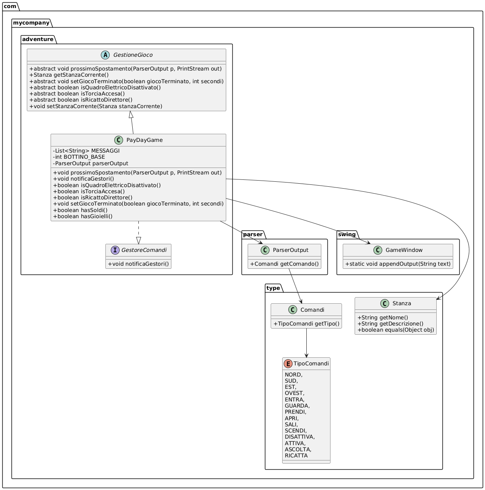
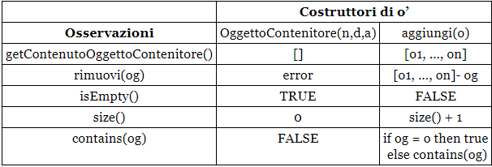

# Avventura testuale - "PayDayGame"

## Gruppo: Mangione Alessandro Aldo, Palumbo Tommaso, Vurchio Christian

## 1. INTRODUZIONE

### 1.1 Introduzione al gioco

Lo sviluppo del progetto è improntato, come richiesto, alla realizzazione di un'avventura testuale, che si basa cioè sulla narrativa testuale per guidare il giocatore attraverso una serie di sfide e scelte. Nel caso specifico, il gioco è un'avventura testuale con alcuni elementi grafici a solo scopo visivo, in quanto i comandi vengono inseriti attraverso una box di testo per cui per giocare è sufficiente l'utilizzo di una tastiera, mentre il puntatore è richiesto solo per la prima scelta all'avvio del software.

### 1.2 Trama

"PayDayGame" è una reinterpretazione del più famoso videogioco "PAYDAY", e tratta di una banda di ladri che cercano di rapinare una banca nel modo migliore possibile. Nella nostra versione il rapinatore è soltanto uno ed ha un piano ben preciso: entrare, disattivare il sistema di sorveglianza, prendere le chiavi dell'ufficio del direttore e da qui la sua tessera personale per poter aprire il caveau e rubare il più possibile, senza ovviamente essere scoperto e/o catturato.

### 1.3 Breve descrizione

Il gioco è un'avventura testuale in cui i giocatori assumono il ruolo di un rapinatore che tenta di svaligiare una banca ben protetta. La missione è complessa e richiede abilità, strategia e sangue freddo.
I giocatori interagiscono con il gioco tramite comandi testuali, muovendosi nelle varie stanze della banca e interagendo con gli oggetti presenti nelle varie stanze. I comandi di movimento includono "nord", "sud", "est", "ovest", "sali", "scendi", ed "entra". Comandi come ad esempio "prendi", "attiva" o "ascolta" seguiti dal nome dell'oggetto permettono di aggiungere oggetti all'inventario, mentre "guarda" offre una descrizione dettagliata della stanza in cui si è in quel momento.

### 1.4 Azioni consigliate per il completamento

Partendo da fuori l'ingresso principale, che sarà controllato da guardie, dovrai spostarti su un lato dell'edificio ed entrare da uno degli ingressi alternativi.

Una volta all'interno dovrai procurarti la torcia per poter vedere anche  con le luci spente, la puoi trovare nel magazzino che si trova di fronte il bagno e subito dopo le scale.

Uscendo dal magazzino e andando a nord fino alla fine del corridoio troverai il quadro elettrico per poter disattivare le telecamere di sicurezza e di conseguenza tutte le luci dell'edificio.

Spostandoti completamente a sud ripercorrendo il corridoio ti ritroverai nella hall principale, dove ad ovest troverai la porta d'ingresso della portineria da cui potrai prendere le chiavi dei diversi uffici e di quello del direttore, nei quali non potresti entrare senza.

Ritornando all'inizio del corridoio, con le chiavi potrai entrare nell'ufficio che si trova ad est, dove troverai un registratore vocale in cui è rivelato il codice di sicurezza della cassetta dei documenti del direttore. (questo passaggio è opzionale. serve per poter conoscere il codice della cassetta dei documenti per ricattare il direttore e ottenere del bottino extra)

Adesso potrai recarti nell'ufficio del direttore nel cui armadio è presente il tesserino che ti da accesso al caveau.

Una volta aperto puoi decidere di prendere solo soldi, solo gioielli o entrambi; nel caso conoscessi il codice della cassetta dei documenti puoi decidere di prenderli e con il comando "ricatta direttore" ricattare il direttore per ricevere una somma extra di denaro.

Puoi adesso uscire dal caveau e dirigerti verso il garage per poter fuggire.

## 2 STRUTTURA DEL SOFTWARE

### 2.1 Diagramma delle classi

Diagramma delle classi relativo a ad una parte significativa del codice, nel nostro caso **prossimospostamento**

### 2.2 Specifica algebrica

Specifica algebrica della struttura dati **Lista**.

Abbiamo deciso di fare una specifica algebrica  per la struttura dati lista, che abbiamo utilizzato nella classe `OggettoContenitore` che eredita dalla classe `Oggetto`, per poter creare un oggetto di tipo lista, al cui interno ci siano tutti gli oggetti che esso contiente.
Per questa struttura dati abbiamo utilizzato metodi da noi implementati, ma anche metodi derivati dall’interfaccia List e implementati dalla classe `ArrayList`.

**Specifica sintattica**

**Sorts:**
-	Oggetto    
-	boolean
-	int
-	List \<Oggetto>
-	String    
-	Set \<String>  

**Operations:**
-	OggettoContenitore (String nome, String descrizione, Set \<String> alias) -> List \<Oggetto>
 (Lista di Oggetti vuota)
-	aggiungi(Oggetto) -> List \<Oggetto>
-	rimuovi(Oggetto) -> List \<Oggetto>
-	getContenutoOggettoContenitore() -> List\<Oggetto>
-	isEmpty() -> boolean
-	size() -> int
-	contains(Oggetto) -> boolean

**Specifica semantica**

**decleare:** n,d: String, a: Set\<String>, o,og: Oggetto, [ ] : List \<Oggetto>   
	

Bisogna precisare che nelle osservazioni non abbiamo passato come parametro la lista o’ ottenuta dai costruttori, perché tali metodi agiscono direttamente su tale lista quando quest’ ultima va ad invocarli. Se avessimo voluto usare come parametro la lista ottenuta dai costruttori, allora nei parametri delle osservazioni, avremmo utilizzato o’. 

**Specifica di restrizione:**

rimuovi(OggettoContenitore(n,d,a)) = error
dove `error` è un elemento speciale indefinito 

### 2.3 Requisiti richiesti

Elenco degli argomenti richiesti utilizzati all'interno del nostro progetto e descrizione dell'utilizzo.

#### 2.3.1 Lambda expression

Le lambda expression sono utilizzate per semplificare il codice, permettono di creare facilmente istanze di interfacce funzionali (interfacce con un solo metodo astratto) e sono utili per definire listener per eventi. 

Nel contesto del progetto, le lambda expression vengono utilizzate per gestire gli eventi dei pulsanti nel pannello del menu. Questo rende il codice più facile da mantenere e capire, poiché il comportamento dell'evento è definito in linea con la creazione del pulsante.

Inoltre, le lambda expressions sono utilizzate nella classe Parser per semplificare e rendere più conciso il processo di ricerca all'interno delle liste. In particolare, nel metodo ricercaIndice, le lambda expressions sono utilizzate per implementare il BiPredicate che confronta elementi della lista con un token specificato.

Nel metodo parse, le lambda expressions sono impiegate per:

* Ricercare un comando nella lista dei comandi disponibili, confrontando il nome o gli alias del comando con il token fornito.
* Ricercare un oggetto nella lista degli oggetti presenti nella stanza o nell'inventario, confrontando il nome o gli alias dell'oggetto con il token fornit

#### 2.3.2 REST/Socket

Le API REST sono utilizzate per la comunicazione tra il client del gioco e il server. Le API REST permettono di inviare richieste al server e di ricevere risposte in formato JSON, facilitando l'integrazione e la scalabilità del sistema.

Nel progetto, l'API di OpenWeatherMap viene utilizzata per ottenere informazioni meteorologiche in tempo reale per una specifica città (Roma). Queste informazioni vengono poi presentate al giocatore all'interno del gioco. In particolare, la classe Meteo è responsabile della connessione all'API, del recupero dei dati e della visuallizzazione nel gioco.

Più nel dettaglio:

Classe **Meteo** contiene il metodo `stampaMeteo(String city)` che:
* Costruisce l'URL per l'API di OpenWeatherMap usando il nome della città e la chiave API.
* Effettua una richiesta HTTP GET all'API.
* Legge la risposta JSON dall'API e la converte in un oggetto `JsonObject` usando la libreria Gson.
* Estrae informazioni chiave come il nome della città, la temperatura e le condizioni meteorologiche dal JSON.
* Crea un messaggio con queste informazioni, descrivendo la situazione meteorologica in modo dettagliato.
* Usa il metodo `appendOutput(String text)` della classe `GameWindow` per visualizzare il messaggio nel gioco.

#### 2.3.3 Thread

L'uso dei thread è fondamentale per gestire operazioni simultanee senza bloccare il flusso principale del gioco. 

In questo progetto sono implementati per attivare e far funzionare il conto alla rovescia (della guardia che cerca di fermarti) che interrompe il gioco se non si è conclusa l'avventura prima dello scadere del tempo

Nel progetto:

1. **Gestione del Timer della Guardia:**

La classe `TimerGuardia` implementa `Runnable` e viene eseguita in un thread separato. Questo permette al timer di decrementare il tempo rimanente in background, senza interrompere altre operazioni del gioco.

2. **Gestione del Tempo in Modo Asincrono:**

* Il metodo `run()` nella classe `TimerGuardia` utilizza un ciclo `while` che continua a eseguire finché il tempo rimanente è maggiore di zero e la variabile `RUNNING` è vera. All'interno del ciclo, il thread attende per un secondo (`Thread.sleep(1000)`) e poi decrementa il tempo rimanente di un secondo.
* Questo approccio garantisce che il conto alla rovescia proceda indipendentemente dalle altre operazioni del gioco, aggiornando il tempo rimanente e notificando l'utente tramite il metodo `GameWindow.appendOutput()`.

3. **Interazione con l'Interfaccia Utente:**

Poiché i thread eseguono operazioni in background, è possibile aggiornare l'interfaccia utente in modo reattivo. Ad esempio, il metodo `appendOutput` di `GameWindow` viene chiamato per aggiornare l'output dell'interfaccia utente con messaggi sullo stato del timer.

#### 2.3.4 Database

Durante l'inizializzazione del gioco, i dati relativi alle stanze e agli oggetti vengono caricati dal database. Questo permette di avere una configurazione iniziale del gioco basata sui dati persistenti, garantendo che ogni volta che il gioco viene avviato, le stanze e gli oggetti siano impostati correttamente secondo la definizione memorizzata nel database.

Nello specifico:

1. **Memorizzazione delle Stanze:** Le informazioni riguardanti le stanze del gioco, inclusi dettagli come nome, descrizione, piano, e connessioni con altre stanze, vengono memorizzate nel database. Questo permette di mantenere una rappresentazione persistente e strutturata del layout del gioco.

2. **Gestione degli Oggetti:** Gli oggetti presenti nelle stanze sono anch'essi salvati nel database. Ogni oggetto ha un set di attributi (nome, descrizione, alias, ecc.) che vengono archiviati per essere facilmente recuperati e manipolati durante il gioco.

3. **Relazioni tra Stanze e Oggetti:** Il database tiene traccia delle relazioni tra le stanze e gli oggetti contenuti in esse. Questo facilita l'aggiornamento e il recupero delle informazioni in modo efficiente, permettendo di sapere in quale stanza si trova ogni oggetto e quali oggetti sono presenti in una determinata stanza.

#### 2.3.5 File

Nel progetto descritto, i file vengono utilizzati per la serializzazione e il salvataggio delle partite, consentendo così di memorizzare e ripristinare lo stato del gioco.

* La **serializzazione** è il processo di conversione di un oggetto Java in una rappresentazione di byte, che può essere facilmente scritta su un file. In questo progetto, la serializzazione viene utilizzata per memorizzare lo stato corrente del gioco, inclusi tutti gli oggetti, le stanze e le variabili pertinenti, su disco.

* Quando il giocatore decide di **salvare** il progresso, il programma esegue la serializzazione dello stato corrente del gioco:

    1. **Stato del Gioco:** Tutte le informazioni rilevanti sullo stato del gioco vengono raccolte. Questo include lo stato corrente delle stanze, gli oggetti contenuti in esse, l'inventario del giocatore, lo stato delle variabili di gioco (ad esempio, se il quadro elettrico è disattivato, se la torcia è accesa, ecc.).

    2. **Serializzazione:** L'oggetto che rappresenta lo stato del gioco viene serializzato utilizzando `ObjectOutputStream`. Questo converte l'oggetto in un flusso di byte.

    3. **Scrittura su File:** Il flusso di byte viene scritto su un file specificato, creando un file di salvataggio. Questo file può essere letto successivamente per ripristinare lo stato del gioco.

* Il **caricamento** di una partita salvata consiste nel leggere il file di salvataggio, deserializzare il flusso di byte e ricostruire lo stato del gioco. Questo permette al giocatore di riprendere esattamente da dove aveva lasciato.

    1. **Lettura del File:** Il file di salvataggio viene aperto e letto utilizzando `ObjectInputStream`.

    2. **Deserializzazione:** Il flusso di byte viene deserializzato per ricreare l'oggetto che rappresenta lo stato del gioco.

    3. **Ripristino dello Stato del Gioco:** L'oggetto deserializzato viene utilizzato per ripristinare tutte le variabili di stato, gli oggetti, le stanze e altre informazioni pertinenti, permettendo al gioco di continuare dal punto in cui era stato salvato.

In conclusione, l'uso dei file per la serializzazione e il salvataggio delle partite è una tecnica efficace per garantire la persistenza dei dati di gioco, offrendo una migliore esperienza utente e maggiore flessibilità.

#### 2.3.6 Swing

Swing è utilizzato per creare l'interfaccia grafica del gioco. Questo toolkit Java fornisce un insieme di componenti GUI che permettono di costruire interfacce utente interattive e personalizzate. In questo progetto, Swing viene utilizzato per progettare le finestre di gioco, i menu, i dialoghi e altre interazioni visive con il giocatore.

**Classi e Componenti Principali di Swing Utilizzati:**

1. GameWindow:
Questa classe rappresenta la finestra principale del gioco, utilizza `JFrame` come finestra principale in cui vengono aggiunti vari pannelli e componenti, contiene un'area di output `JTextArea` per visualizzare il testo del gioco e un campo di input `JTextField` per inserire i comandi ed un pulsante `JButton` per inviare i comandi.

2. MenuPanel:
Questo pannello rappresenta il menu principale del gioco, utilizza `JButton` per consentire al giocatore di avviare una nuova partita, caricare una partita esistente o uscire dal gioco. `GridBagLayout` è utilizzato per posizionare i pulsanti all'interno del pannello.

3. BackgroundPanel:
Un pannello personalizzato che mostra un'immagine di sfondo, utilizza `JPanel` e sovrascrive il metodo paintComponent per disegnare un'immagine di sfondo.

4. TextAreaOutputStream:
Una classe che estende `OutputStream` e reindirizza l'output di un flusso di byte verso una `JTextArea` ed è utilizzata per mostrare l'output della console.
